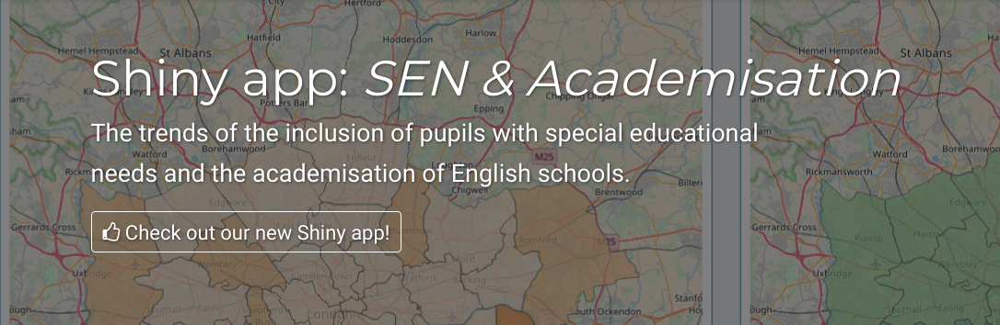

  

# Shiny web app "SEN & Academisation"

The companion web app for ESRC research project
["Inclusion and the academisation of English secondary schools: trends in the placement of pupils with significant SEN and those permanently excluded"](https://sen-england.github.io/)
by
[Dr Alison Black](https://socialsciences.exeter.ac.uk/education/staff/index.php?web_id=alison_black),
[Dr Yi Liu](https://yiliu6240.github.io),
[Dr Alexey Bessudnov](http://abessudnov.net/)
and
[Professor Brahm Norwich](https://socialsciences.exeter.ac.uk/education/staff/index.php?web_id=brahm_norwich).
This web app is aimed to be an online visualisation tool to provide overview and insights into the trends and distributions of academisation and educational inclusion in England.

For technical specifications in general, please refer to [technical specification](./docs/technical-specs.md).

Please visit [our project website](https://sen-england.github.io/) for more details.

# Showcase

**Primary dashboard**

**Time series trends**

**Breakdown by region**

